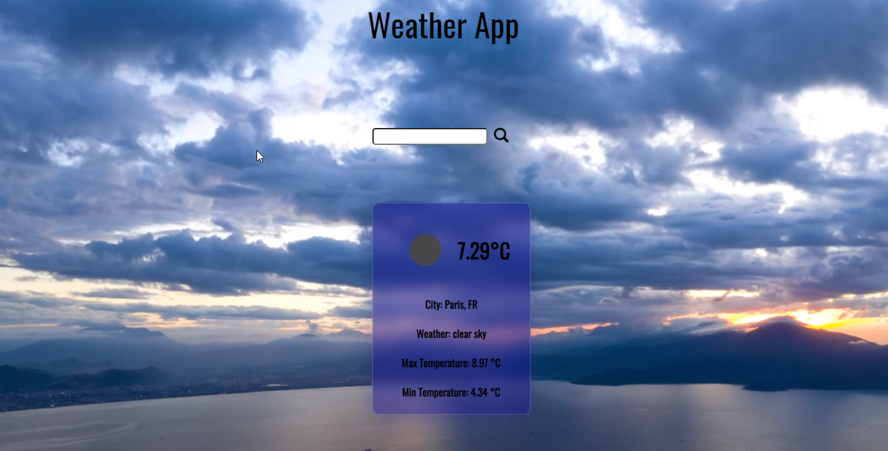

# Weather App

App de clima creada con Svelte.js

## Tecnologies

- [Svelte](https://svelte.dev/).
- [Vite](https://vitejs.dev/).
- [TypeScript](https://www.typescriptlang.org/).
- [Git](https://git-scm.com/).
- [Animate.css](https://animate.style/).
- HTML.
- CSS.
- JavaScript.

## Screenshots

- Vista principal de la app.
  
